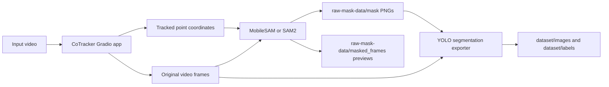

# Object-in-Video Detector

This repository combines CoTracker point tracking with MobileSAM/SAM2 mask
generation to turn a short video into frame-level object masks and, optionally,
an Ultralytics YOLO segmentation dataset.

The intended workflow is:

1. Track an object or region through a video with CoTracker.
2. Export the original frames and tracked point coordinates.
3. Use those coordinates as point prompts for MobileSAM or SAM2.
4. Save preview videos, raw masks, and processed prompt JSON.
5. Convert the raw masks into YOLO polygon labels.

## Repository Layout

```text
co-tracker-main/                  CoTracker source plus the custom Gradio app
MobileSAM-master/                 MobileSAM/SAM2 wrappers and Gradio app
sam2/                             Local SAM2 dependency source
export_yolo_segmentation_dataset.py
                                  Raw mask to YOLO segmentation converter
run_mobilesam_from_coordinates.py CLI wrapper for MobileSAM coordinate prompts
run_sam2_from_coordinates.py      CLI wrapper for SAM2 coordinate prompts
cleanup_generated_materials.sh    Clears generated frame/mask/coordinate folders
tests/                            Root-level tests for dataset export
```

Generated data is intentionally ignored by git. The main generated folders are:

```text
data/frames/
data/coordinates/
raw-mask-data/frames/
raw-mask-data/coordinates/
raw-mask-data/mask/
raw-mask-data/masked_frames/
dataset/
sam-video-preview/
run_logs/
```

## How It Works



### CoTracker Stage

The CoTracker app runs at port `7860`. It lets you upload a video, select
positive and negative points, track them through time, and refine the tracked
points on processed frames.

Important outputs:

- `data/frames/`: original video frames saved as PNG files.
- `data/coordinates/`: per-frame JSON prompt files containing tracked point
  coordinates and labels.
- The third step can preview SAM/SAM2 masks on the tracked frames.
- `Save SAM Video Preview` writes the SAM video review as an MP4.
- `Save Preview as YOLO Custom` runs the YOLO segmentation exporter from the UI.

### MobileSAM/SAM2 Stage

The MobileSAM app runs at port `8080`. Its coordinate-folder mode reads
matching frames and JSON prompts, then writes mask outputs.

The wrapper keeps the original CoTracker points as positive prompts and can
generate negative prompts around them. Supported negative layouts include box
corner/edge points and oriented side points for diagonal object shapes.

Important outputs:

- `raw-mask-data/frames/`: frames selected for segmentation.
- `raw-mask-data/coordinates/`: augmented prompt JSON files.
- `raw-mask-data/mask/`: single-channel mask PNG files.
- `raw-mask-data/masked_frames/`: visual mask preview frames.

Mask values used by the YOLO exporter:

- `1`: object/wound pixels.
- `0`: background.
- `225` or `255`: ignored pixels, not exported as polygons.

### YOLO Dataset Stage

`export_yolo_segmentation_dataset.py` converts raw frame/mask pairs into an
Ultralytics segmentation dataset:

```text
dataset/
  images/
    train/
    val/
  labels/
    train/
    val/
  dataset.yaml
```

Each label row is a YOLO segmentation polygon:

```text
0 x1 y1 x2 y2 ... xn yn
```

Class `0` is named `wound` in `dataset.yaml`.

## Quick Start

From the repository root:

```bash
cd /Users/wanglihang/Desktop/feel_intern/cotracker+MSAM
```

Start CoTracker:

```bash
PORT=7860 GRADIO_SKIP_PYI_GENERATION=1 COTRACKER_DISABLE_EXAMPLES=1 \
.venv_local/bin/python co-tracker-main/gradio_demo/app.py
```

Open:

```text
http://127.0.0.1:7860
```

Start MobileSAM/SAM2 UI:

```bash
cd MobileSAM-master/app
PYTHONPATH=.. PORT=8080 ../../.venv_local/bin/python app.py
```

Open:

```text
http://127.0.0.1:8080
```

## End-to-End UI Workflow

1. Open CoTracker at `http://127.0.0.1:7860`.
2. Upload a short `.mp4` video.
3. Choose tracking resolution and optional frame limits.
4. Click `Submit`.
5. Select positive points on the object. Add negative points if useful.
6. Click `Track`.
7. Click `Store Frames` to write `data/frames/`.
8. Click `Store Coordinates of Tracked Object` to write `data/coordinates/`.
9. Open MobileSAM at `http://127.0.0.1:8080`.
10. In coordinate-folder mode, set:

```text
Frame folder:      /Users/wanglihang/Desktop/feel_intern/cotracker+MSAM/data/frames
Coordinate folder: /Users/wanglihang/Desktop/feel_intern/cotracker+MSAM/data/coordinates
```

11. Choose `frame_step`, negative prompt mode, and padding parameters.
12. Run MobileSAM/SAM2 from coordinate folders.
13. Review outputs under `raw-mask-data/`.
14. In CoTracker step 3, use `Save Preview as YOLO Custom`, or run the CLI
    exporter below.

## CLI Commands

Run SAM2 from stored CoTracker prompts:

```bash
.venv_local/bin/python run_sam2_from_coordinates.py \
  --frames-dir data/frames \
  --coordinates-dir data/coordinates \
  --output-root raw-mask-data \
  --frame-step 3 \
  --negative-mode box_8_oriented \
  --padding-ratio 0.08 \
  --min-padding-px 20 \
  --min-negative-distance 3 \
  --download-checkpoint
```

Run MobileSAM from stored CoTracker prompts:

```bash
.venv_local/bin/python run_mobilesam_from_coordinates.py \
  --frames-dir data/frames \
  --coordinates-dir data/coordinates \
  --output-root raw-mask-data \
  --frame-step 3 \
  --negative-mode box_8_oriented \
  --padding-ratio 0.08 \
  --min-padding-px 20 \
  --min-negative-distance 3
```

Export YOLO segmentation dataset:

```bash
.venv_local/bin/python export_yolo_segmentation_dataset.py \
  --raw-mask-root raw-mask-data \
  --output-dir dataset \
  --train-ratio 0.8 \
  --min-area-px 20 \
  --approx-epsilon 2.0
```

Clear generated frame/mask/coordinate folders:

```bash
./cleanup_generated_materials.sh
```

## Useful Parameter Notes

- `frame_step`: process every Nth frame. For example, `3` processes every third
  frame, regardless of source video FPS.
- `padding-ratio`: expands the prompt box before generating negative points.
  Lower values keep negatives closer to the object.
- `min-padding-px`: guarantees a minimum expansion around positive points.
- `min-negative-distance`: removes generated negative points that are too close
  to positive points.
- `negative-mode=box_8_oriented`: combines box-style negatives with oriented
  side negatives, which can help diagonal or elongated objects.
- `score-threshold`: low-confidence masks can be encoded as ignored pixels
  instead of object pixels.

## Development Checks

Run the focused project tests:

```bash
.venv_local/bin/python -m unittest tests/test_yolo_segmentation_dataset_export.py -v
PYTHONPATH=co-tracker-main .venv_local/bin/python -m unittest \
  co-tracker-main/tests/test_device.py \
  co-tracker-main/tests/test_gradio_app_wiring.py \
  co-tracker-main/tests/test_gradio_export_helpers.py \
  co-tracker-main/tests/test_refinement_helpers.py \
  co-tracker-main/tests/test_tracking_helpers.py -v
PYTHONPATH=co-tracker-main .venv_local/bin/python co-tracker-main/tests/test_bilinear_sample.py -v
```

## Troubleshooting

- If CoTracker is slow on Apple Silicon, use a lower tracking resolution, shorter
  clips, or larger frame-step values.
- If SAM masks are too large, reduce `padding-ratio`, reduce
  `min-padding-px`, or increase the number/quality of negative prompts.
- If the YOLO exporter reports missing masks, make sure frame names in
  `raw-mask-data/frames/` match mask names in `raw-mask-data/mask/`.
- If GitHub push fails over HTTPS, authenticate with `gh auth login` or switch
  the remote URL to SSH.
